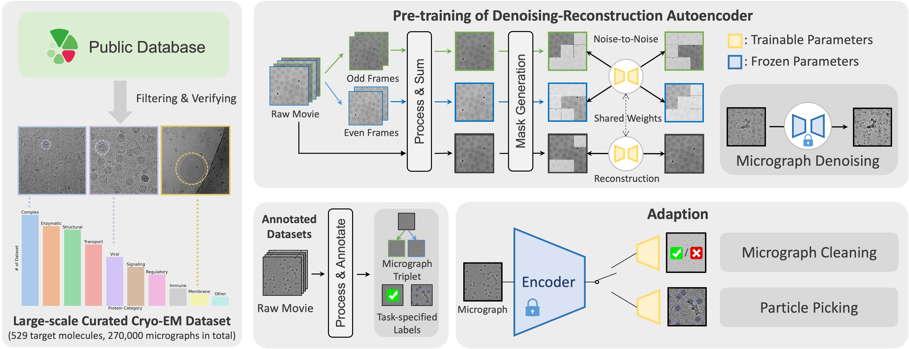
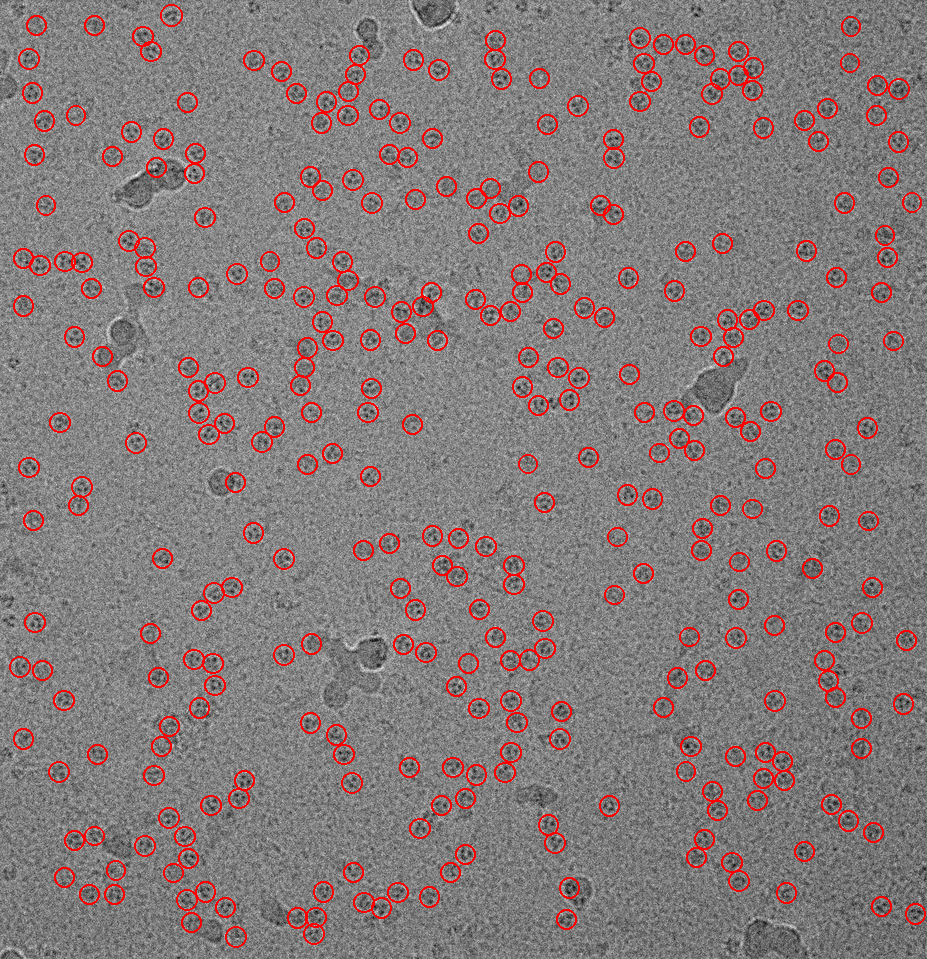
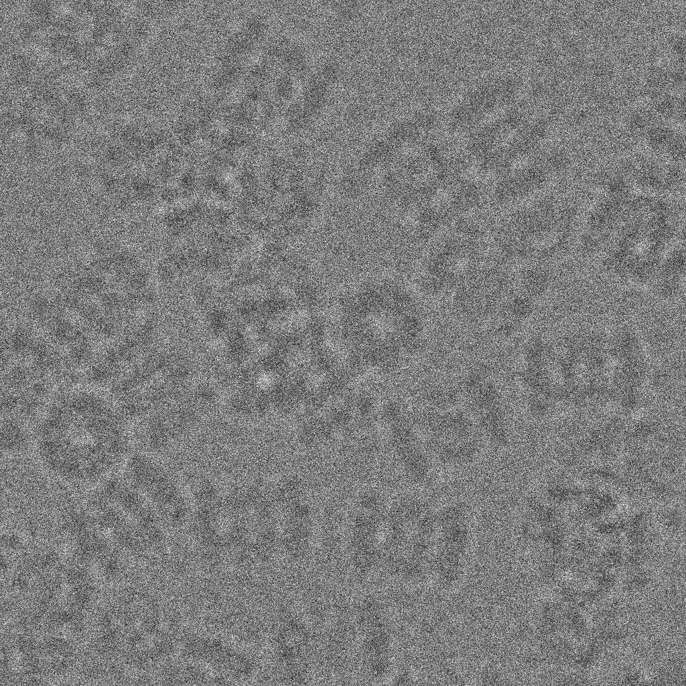
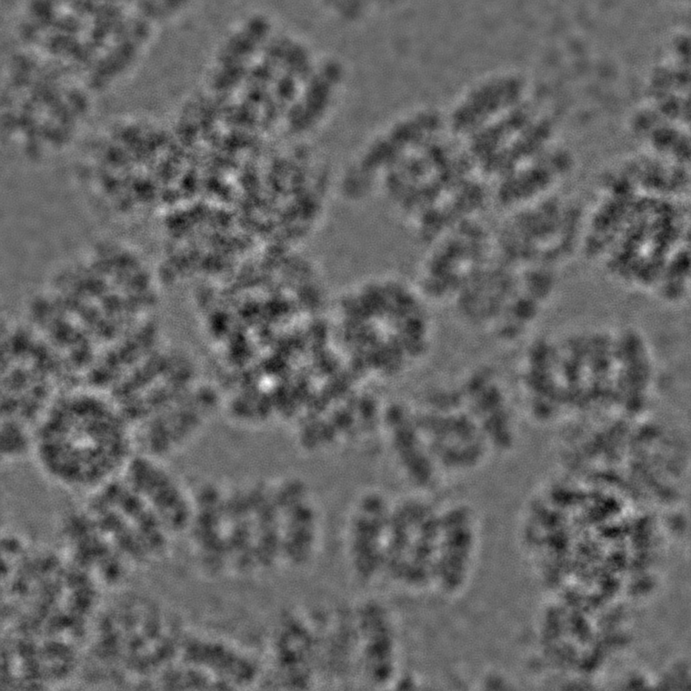

# DRACO: A Denoising-reconstrution Autoencoder for Cryo-EM

Accepted by NeurIPS 2024 | [project page](https://duskngai.github.io/draco/)

Yingjun Shen, Haizhao Dai, Qihe Chen, Yan Zeng, Jiakai Zhang, Yuan Pei, Jingyi Yu

<p align="center">
  
</p>

## TODOS
- [ ] Hugging face denoise demo with more controllability
- [ ] More compatibility with modern softwares, i.e., supporting `.star` file output
- [ ] More downstream tasks (particle level)

## Setup

First, download the codebase:

```bash
git clone https://github.com/Cellvers/draco.git -o draco && cd draco
```

Second, install the dependencies by **manually installing them**:
- Install dependencies manually:
    ```bash
    conda create -n draco python=3.11
    conda activate draco
    conda install pytorch torchvision pytorch-cuda=12.1 -c pytorch -c nvidia
    conda install h5py ipykernel lightning matplotlib "numpy<2.0.0" pandas rich scipy
    pip install fvcore mrcfile omegaconf timm opencv-python pycocotools
    ```

## Pretrained models
We have pretrained DRACO with two different parameter size. You can adapt DRACO's encoder to your own downstream task. If you want to use the large model parameters, please refer to [Licence](#licence).

<div class="center">

|      Model name      | Model size | 
| :---------------: | :------: | 
| Draco/B |    [Base](https://drive.google.com/file/d/1fPhu5q8W859ZTWTsWJ7vyFnFoONQIFEx/view?usp=drive_link)    |

</div>

Please refer to the [jupyter script](notebook/draco_pretrain.ipynb) for further instructions.

## Usage

This repository contains the inferencing code of the downstream tasks mentioned in the paper. We also provide a `.h5` format [data sample](https://drive.google.com/file/d/1yYkDjSGfXY6UYTDULOCYmJSEYtCHAngr/view?usp=drive_link), which is from Empiar-10096, for inferencing. If you want to use the large model parameters, please refer to [Licence](#licence).

### 1. Particle picking
For particle picking, we have finetuned two models with different parameter size using pretrained draco model.

<p align="center">
  
</p>

<div class="center">

|      Model name      | Model size | 
| :---------------: | :------: | 
| Detectron/B |    [Base](https://drive.google.com/file/d/1ii-XvIZqGc7dWcVadFl2b6kySRzQ4Wer/view?usp=drive_link)    |

</div>

Please refer to the [jupyter script](notebook/draco_detectron.ipynb) for further instructions.

### 2. Denoising
For micrograph denoising, we further finetune our model on base parameter size.

<div style="display: flex; justify-content: space-around;">
    
    
</div>

|      Model name      | Model size | 
| :---------------: | :------: | 
| Denoise/B |    [Base](https://drive.google.com/file/d/1z6DunE6skfKNODC6vOJ_48QXHRBzBPyK/view?usp=drive_link)    | 

Please refer to the [jupyter script](notebook/draco_denoise.ipynb) for further instructions.

# Acknowledgements
DRACO uses [detectron2](https://github.com/facebookresearch/detectron2) as the detection framework for particle picking.

# Licence

DRACO source code is released under the Creative Commons Attribution-Non-Commercial ShareAlike International License, Version 4.0 (CC-BY-NC-SA 4.0) (the "License"); you may not use this file except in compliance with the License. You may obtain a copy of the License at https://github.com/Cellverse/draco/blob/main/LICENSE.

We only provide base model parameters for users to freely download and use them for non-commercial purposes. If users want to use the large model parameters, please send an email to `contact@cellverse.tech` with a brief description of your intended research use and your organization.

Use restrictions for all model parameters: 
* They are provided solely for non-commercial use by non-commercial organizations, and redistribution or use for other purposes is prohibited. 
* You cannot publish or share DRACO model parameters outside your organization. However, sharing internally for approved non-commercial use is allowed. 
* You may share and adapt DRACO output under these terms, with requirements for clear notice of modifications.

# Citation

```
@article{shen2024draco,
  title={DRACO: A Denoising-Reconstruction Autoencoder for Cryo-EM},
  author={Shen, Yingjun and Dai, Haizhao and Chen, Qihe and Zeng, Yan and Zhang, Jiakai and Pei, Yuan and Yu, Jingyi},
  journal={Advances in Neural Information Processing Systems},
  volume={38},
  year={2024}
}
```
